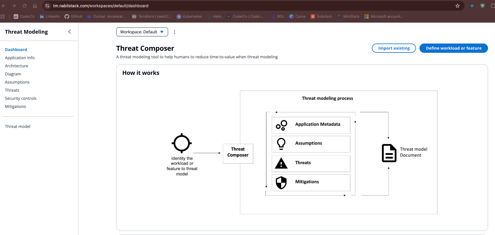
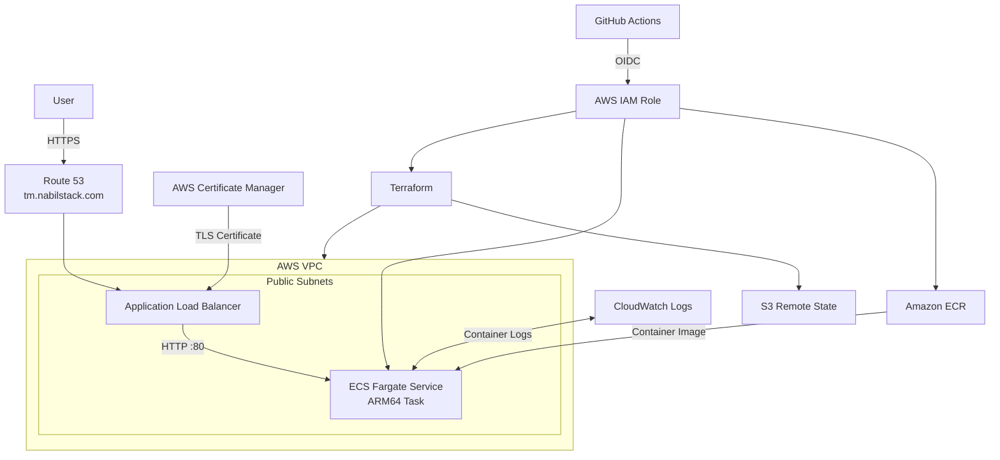
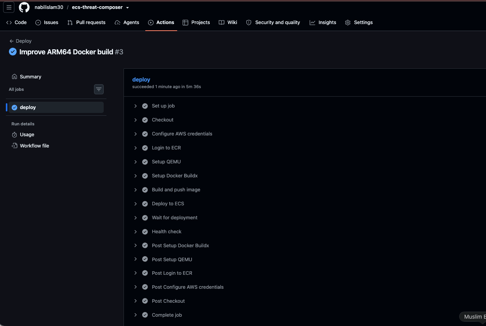
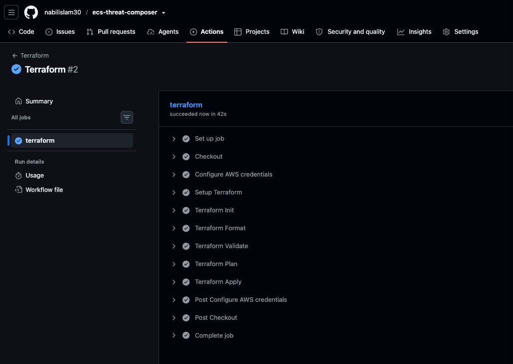

# Threat Composer on AWS ECS Fargate


## Project Overview

This project demonstrates the end-to-end deployment of the Threat Composer application on AWS using Docker, ECS Fargate, Terraform and GitHub Actions.

The infrastructure was first deployed manually through the AWS Console to understand how the individual services interact. Once the application was successfully running over HTTPS, the manually created resources were removed and rebuilt using modular Terraform.

The final deployment uses Amazon ECR for container images, ECS Fargate for running the application, an Application Load Balancer for traffic routing, Route 53 for DNS and AWS Certificate Manager for HTTPS. Terraform state is stored remotely in Amazon S3.

CI/CD is handled through separate GitHub Actions workflows. GitHub authenticates to AWS using OIDC rather than static access keys. Application changes automatically build an ARM64 Docker image, tag it with the Git commit SHA, push it to ECR, deploy it to ECS and verify the deployment using the application's `/health` endpoint.

## Live Application

**Application:** https://tm.nabilstack.com




## Table of Contents

- [Project Overview](#project-overview)
- [Live Application](#live-application)
- [Architecture](#architecture)
- [Technology Stack](#technology-stack)
- [Repository Structure](#repository-structure)
- [AWS Infrastructure](#aws-infrastructure)
- [Terraform](#terraform)
- [CI/CD](#cicd)
- [How to Reproduce](#how-to-reproduce)
- [Challenges and Lessons Learned](#challenges-and-lessons-learned)


## Architecture

The application runs on ECS Fargate behind an Application Load Balancer. Route 53 points the `tm.nabilstack.com` subdomain to the ALB, while ACM provides the TLS certificate used for HTTPS.

The ECS tasks run in public subnets, but inbound traffic to the container is restricted by the ECS security group so that port 80 can only be reached from the ALB.



### Traffic flow

1. A request is made to `https://tm.nabilstack.com`.
2. Route 53 resolves the domain to the Application Load Balancer.
3. The ALB handles HTTPS using the ACM certificate.
4. Traffic is forwarded to the ECS Fargate service on port 80.
5. The container image is pulled from Amazon ECR.
6. Application logs are sent to CloudWatch Logs.

Terraform manages the AWS infrastructure, while its state is stored remotely in S3. GitHub Actions uses OIDC to authenticate to AWS for both infrastructure changes and application deployments.

## Technology Stack

| Technology | Use in this project |
|---|---|
| AWS ECS Fargate | Runs the containerised Threat Composer application |
| Amazon ECR | Stores Docker images |
| Application Load Balancer | Routes traffic to the ECS service |
| Route 53 | Manages DNS for `tm.nabilstack.com` |
| AWS Certificate Manager | Provides the HTTPS certificate |
| Amazon VPC | Provides the network used by the ALB and ECS tasks |
| IAM | Provides permissions for ECS and GitHub Actions |
| CloudWatch Logs | Stores ECS container logs |
| Amazon S3 | Stores the remote Terraform state |
| Terraform | Builds and manages the AWS infrastructure |
| Docker | Builds the application image |
| NGINX | Serves the built frontend and exposes `/health` |
| GitHub Actions | Runs the Terraform and application deployment pipelines |
| GitHub OIDC | Allows GitHub Actions to authenticate to AWS without stored access keys |

## Repository Structure

```text
ecs-threat-composer/
├── .github/
│   └── workflows/
│       ├── deploy.yml
│       └── terraform.yml
│
├── app/
│   ├── public/
│   ├── src/
│   ├── .dockerignore
│   ├── Dockerfile
│   ├── nginx.config
│   ├── package.json
│   └── yarn.lock
│
├── infra/
│   ├── modules/
│   │   ├── acm/
│   │   │   ├── main.tf
│   │   │   ├── outputs.tf
│   │   │   └── variables.tf
│   │   ├── alb/
│   │   │   ├── main.tf
│   │   │   ├── outputs.tf
│   │   │   └── variables.tf
│   │   ├── ecr/
│   │   │   ├── main.tf
│   │   │   ├── outputs.tf
│   │   │   └── variables.tf
│   │   ├── ecs/
│   │   │   ├── main.tf
│   │   │   ├── outputs.tf
│   │   │   └── variables.tf
│   │   ├── networking/
│   │   │   ├── main.tf
│   │   │   ├── outputs.tf
│   │   │   └── variables.tf
│   │   └── security/
│   │       ├── main.tf
│   │       ├── outputs.tf
│   │       └── variables.tf
│   ├── backend.tf
│   ├── main.tf
│   ├── output.tf
│   ├── provider.tf
│   └── variables.tf
│
├── .gitignore
└── README.md
```

## How to Reproduce

I built the project in stages, starting with local testing before moving to AWS, Terraform and CI/CD.

### Prerequisites

- AWS account
- AWS CLI
- Terraform
- Docker
- GitHub repository
- Domain hosted in Route 53

### 1. Local Application Setup

Move into the application directory:

```bash
cd app
```

Build the Docker image:

```bash
docker build -t threatmod .
```

Run the container locally:

```bash
docker run --rm -p 8080:80 --name threatmod-test threatmod
```

Verify the health endpoint:

```bash
curl http://localhost:8080/health
```

### 2. Docker Containerisation

The application uses a multi-stage Dockerfile with Node.js for the build stage and NGINX for the runtime stage.

The final container:

- runs as a non-root user
- exposes port 80
- serves the Threat Composer frontend through NGINX
- exposes `/health` for health checks

### 3. Push Image to Amazon ECR

Check the AWS account being used:

```bash
aws sts get-caller-identity
```

Authenticate Docker to ECR:

```bash
aws ecr get-login-password --region eu-west-2 \
| docker login --username AWS --password-stdin \
<ACCOUNT_ID>.dkr.ecr.eu-west-2.amazonaws.com
```

Tag the image:

```bash
docker tag threatmod:latest \
<ACCOUNT_ID>.dkr.ecr.eu-west-2.amazonaws.com/threat-composer:latest
```

Push the image:

```bash
docker push \
<ACCOUNT_ID>.dkr.ecr.eu-west-2.amazonaws.com/threat-composer:latest
```

### 4. ClickOps | Manual AWS Deployment

I first created the main infrastructure manually through the AWS Console to understand how the services worked together.

This included:

- ECS Cluster
- Fargate Task Definition and Service
- Application Load Balancer
- Target Group
- Security Groups
- Route 53 DNS
- ACM certificate

Once the application was reachable over HTTPS, the manually created resources were removed.

### 5. Rebuild with Terraform

The infrastructure was then rebuilt using modular Terraform.

From the `infra` directory:

```bash
terraform init
terraform fmt -check -recursive
terraform validate
terraform plan
terraform apply
```

Terraform manages the networking, security groups, ECR, ECS, ALB, ACM and Route 53 configuration.

### 6. Automate with GitHub Actions

Two GitHub Actions workflows are used:

- `terraform.yml` for infrastructure deployment
- `deploy.yml` for building and deploying the application

GitHub Actions authenticates to AWS using OIDC instead of stored AWS access keys.

### 7. Verify the Deployment

Verify the live application:

```bash
curl https://tm.nabilstack.com/health
```

Expected response:

```json
{"status":"ok"}
```

## AWS Infrastructure

The AWS setup was first created manually through the console, then removed and rebuilt using Terraform.

The final infrastructure includes:

- VPC with two public subnets
- Application Load Balancer
- ECS Cluster and Fargate service
- ECR repository
- Security Groups
- ACM certificate
- Route 53 DNS record
- IAM execution role
- CloudWatch Logs
- S3 remote Terraform state

The ECS tasks run in public subnets with public IPs, but inbound traffic to the application is restricted so only the ALB can reach the container on port 80.

HTTP traffic is redirected to HTTPS at the load balancer.

## Terraform

The AWS infrastructure is managed using modular Terraform.

The configuration is split into separate modules for:

- Networking
- Security
- ECR
- ACM
- Application Load Balancer
- ECS

Terraform state is stored remotely in an S3 bucket with versioning enabled.

Main commands used:

```bash
terraform init
terraform fmt -check -recursive
terraform validate
terraform plan
terraform apply

````

## CI/CD

### Deploy and post Health



### Terraform Pipeline




## Challenges and Lessons Learned

A few issues came up during the project which helped me understand the deployment process in more detail:

- Running NGINX as a non-root user caused a PID permission issue, which I fixed by moving the PID file to `/tmp`.
- ACM validation took longer than expected due to Route 53 hosted zone issues, so I had to troubleshoot DNS records and certificate validation.
- Building an ARM64 image in GitHub Actions was initially very slow because of emulation. I changed the Docker build so the build stage could run natively while still producing an ARM64 runtime image.
- The GitHub Actions build also hit a Yarn network timeout, which I fixed by increasing the Yarn network timeout.
- Terraform required ECR to exist and contain an image before ECS could start successfully, so I handled the initial ECR bootstrap separately.
- Using OIDC with GitHub Actions gave me a better understanding of how AWS can be accessed securely without storing long-lived credentials.